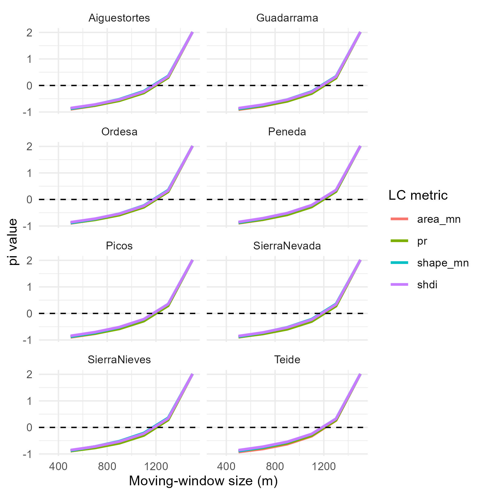

Landscape metrics were calculated using the [Fragstas tool](https://www.fragstats.org/).

The coverage map chosen was [CORINE Land Cover][def]  since it is available for all of Europe with good spatial resolution. To determine the size of the mobile window to be used, a sensitivity analysis was used to determine the threshold where the analysis goes from micro to macro scale.

**Figure 1:** In this figure we can see that the optimal value is 1100 meters.

The variables calculated were those detailed in this table

[def]: https://land.copernicus.eu/en/products/corine-land-cover